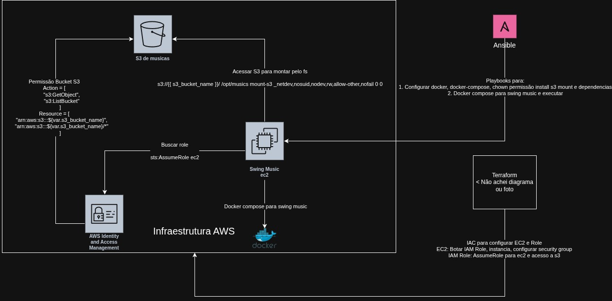

# Swing Music Playbook

Um servidor de música pessoal: o **SwingMusic** roda em uma instância EC2, enquanto a biblioteca permanece em um bucket S3. Terraform cria a infraestrutura e o Ansible configura e publica a aplicação.



Arquivo editável: [diagram/Diagrama.drawio](diagram/Diagrama.drawio).

## Arquitetura e o porquê de cada parte

```text
Navegador ── HTTP :80 ──> EC2 (Docker / SwingMusic :1970)
                                  │
                                  └── /opt/musics ── Mountpoint for Amazon S3 ──> bucket S3
                                        (somente leitura, via role IAM da EC2)
```

| Componente | Responsabilidade | Por que existe |
| --- | --- | --- |
| **S3** | Guarda os arquivos de música. | Separa a biblioteca do disco da EC2: os arquivos continuam disponíveis se a instância for recriada. |
| **IAM role + instance profile** | Concede `s3:ListBucket` e `s3:GetObject` apenas ao bucket configurado. | A EC2 obtém credenciais temporárias automaticamente, sem chaves AWS gravadas no servidor. A permissão é somente de leitura para proteger a coleção. |
| **EC2 Amazon Linux 2023** | Executa o Docker e o SwingMusic. | É a máquina de processamento e exposição da aplicação. A AMI é buscada dinamicamente para usar a versão mais recente compatível. |
| **Security group** | Controla as portas permitidas. | SSH fica limitado ao CIDR informado; HTTP é público para entregar a interface web. |
| **Mountpoint for Amazon S3** | Monta o bucket em `/opt/musics`. | Faz a coleção do S3 parecer uma pasta local, exatamente como o container espera receber músicas. A entrada no `fstab` remonta o bucket após reinicializações. |
| **Docker Compose** | Executa e reinicia o container `ghcr.io/swingmx/swingmusic`. | Mantém a instalação reproduzível e persiste a configuração em `/opt/swingmusic/config`. |
| **Terraform** | Cria EC2, role, policy, profile, chave e security group. | Infraestrutura versionada e repetível. |
| **Ansible** | Instala dependências, configura a montagem e sobe o serviço. | Configura o sistema operacional de modo idempotente, depois que a EC2 existe. |

## Pré-requisitos

- Conta AWS e credenciais configuradas localmente (`aws configure` ou variáveis de ambiente).
- Terraform `>= 1.5`.
- Ansible e acesso SSH à instância.
- Uma chave pública em `terraform/tchola.pub`. Para criar uma chave dedicada:

  ```bash
  ssh-keygen -t ed25519 -f terraform/tchola
  ```

  O repositório ignora chaves públicas e privadas; mantenha-as fora do Git.

- Um bucket S3 já criado, na mesma região ou acessível pela instância, contendo a biblioteca musical.

## Provisionar a infraestrutura

Crie `terraform/terraform.tfvars` (esse arquivo é ignorado pelo Git):

```hcl
aws_region              = "sa-east-1"
s3_bucket_name          = "meu-bucket-de-musicas"
allowed_ssh_cidr        = "SEU_IP_PUBLICO/32"
allowed_swingmusic_cidr = "0.0.0.0/0"
```

Depois, aplique a infraestrutura:

```bash
terraform -chdir=terraform init
terraform -chdir=terraform plan
terraform -chdir=terraform apply
terraform -chdir=terraform output
```

Use um CIDR específico em `allowed_ssh_cidr` — por exemplo, `203.0.113.10/32` — para não expor o SSH. O security group também libera SSH para `18.228.70.32/29`, conforme definido no código. Para tornar o serviço privado, restrinja `allowed_swingmusic_cidr` ao seu IP ou à sua rede.

## Configurar e publicar o SwingMusic

Crie `ansible/inventory.ini` usando o IP retornado pelo Terraform:

```ini
[servidor]
IP_PUBLICO_DA_EC2 ansible_user=ec2-user
```

O `ansible.cfg` espera a chave privada em `~/.ssh/tchola.pem`. Ajuste esse caminho ou use `--private-key` se sua chave tiver outro nome.

Rode os playbooks nesta ordem:

```bash
cd ansible
ansible-playbook playbooks/install.yml -e "s3_bucket_name=meu-bucket-de-musicas"
ansible-playbook playbooks/install-swingmusic.yml
```

O primeiro playbook instala Mountpoint for Amazon S3 e Docker, cria `/opt/musics`, registra a montagem persistente e adiciona `ec2-user` ao grupo Docker. O segundo cria o Compose, mantém os dados de configuração separados e inicia o container.

Ao terminar, acesse:

```text
http://IP_PUBLICO_DA_EC2/
```

## Portas e observação importante

O Compose publica `0.0.0.0:80:1970`: a porta **1970** é interna ao container e a porta **80** é a porta pública correta. Portanto, o output Terraform `swingmusic_url`, que monta uma URL com `:1970`, não corresponde ao mapeamento atual e não deve ser usado como URL de acesso. A regra de entrada `1970` do security group também não é necessária com essa configuração; ela só faria sentido se o host publicasse essa porta diretamente.

O projeto ainda opera em HTTP. Antes de expor o servidor na internet, o próximo passo recomendado é colocar um domínio e HTTPS (por exemplo, com um proxy reverso e certificado TLS), além de restringir os CIDRs quando possível.

## Estrutura do repositório

```text
terraform/                 # Recursos AWS e variáveis de infraestrutura
ansible/playbooks/         # Preparação da EC2 e deploy da aplicação
ansible/playbooks/templates/compose.yml.j2
                           # Template do serviço Docker Compose
diagram/Diagrama.drawio    # Fonte editável do diagrama
diagram/Diagrama.png       # Diagrama exibido neste README
```

## Operação rápida

```bash
# Ver logs do serviço
ssh ec2-user@IP_PUBLICO_DA_EC2 'cd /opt/swingmusic && docker compose logs -f'

# Reiniciar o serviço
ssh ec2-user@IP_PUBLICO_DA_EC2 'cd /opt/swingmusic && docker compose restart'

# Destruir a infraestrutura quando não for mais usar
terraform -chdir=terraform destroy
```

`destroy` remove a EC2 e os recursos administrados por este Terraform. O bucket S3 não é criado por este projeto, portanto as músicas não são apagadas por esse comando.
